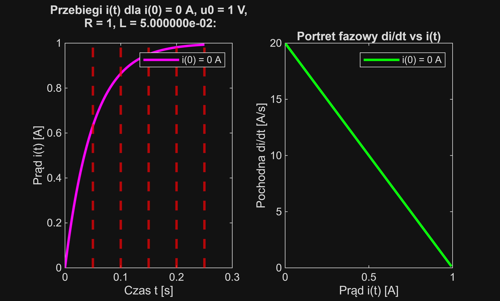
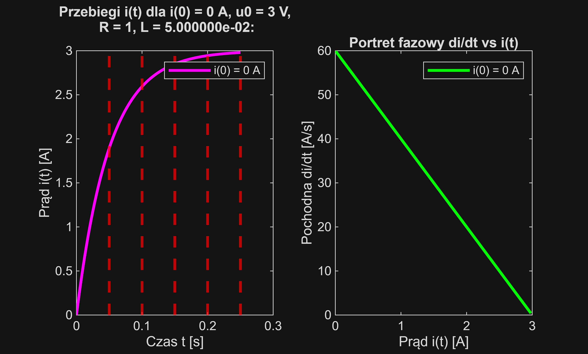
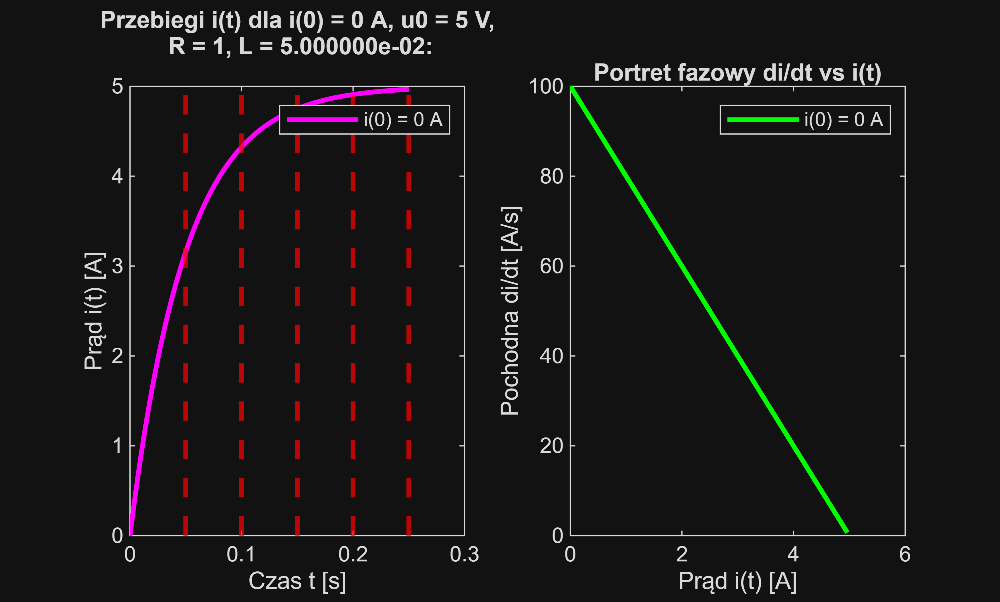
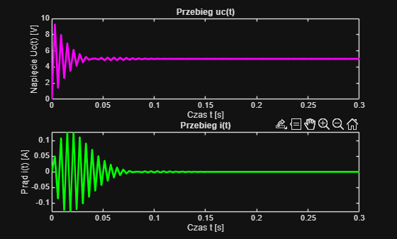
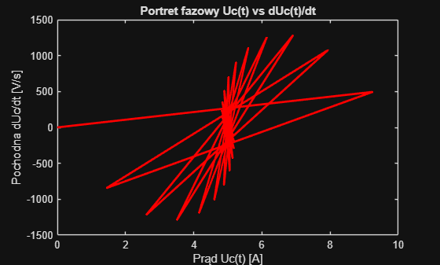
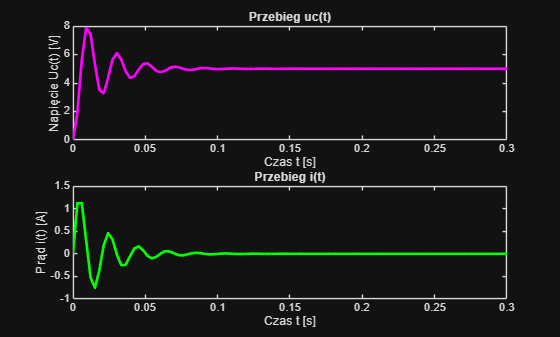
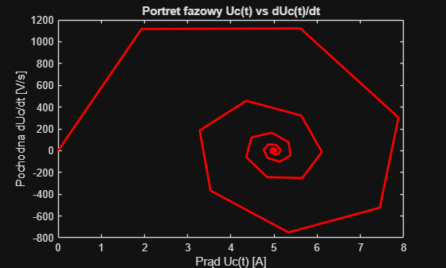
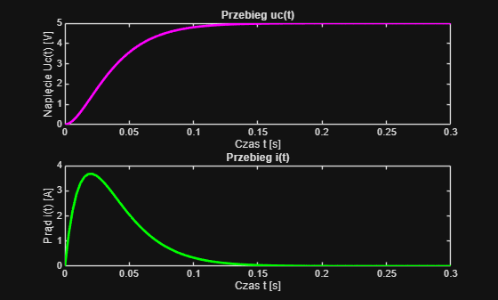
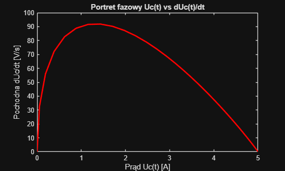

# Dynamic Modeling of RL and RLC Circuits in MATLAB


## Project Overview

The project consists of two separate MATLAB LiveScript files, each performing a relatively simple time-domain system analysis. 
The first script is dedicated to the first-order (RL) circuit, and the second to the second-order (RLC) circuit. 
Both scripts use the MATLAB Symbolic Math Toolbox add-on to analytically solve the ordinary differential equations (ODEs) that govern the response of the electrical circuit. 

The primary goal is to understand and visualize the transient response of these circuits by analyzing the impact of different parameters, such as initial conditions, input voltage, and component values (L, C).

This project was a laboratory assignment for the "Dynamic Systems Modeling" course at the Cracow University of Technology.

## Key Features

Both scripts use `dsolve` to find the exact analytical formulas for current $i(t)$ and capacitor voltage $u_c(t)$.
Then they generate plots showing the time-based response for various scenarios (e.g., $i(t)$, $u_c(t)$).
The first file shows that in every RL circuit (and in every first-order circuit) the time needed for the system to reach steady state is approximately five time constants $\tau$. The second file, which analyzes an RLC circuit, generates phase plots (e.g., $i$ vs. $di/dt$) to visualize the system's dynamics and stability.

---

## Sample Results

Here are some examples of the plots generated by the scripts.

### Exercise 1: RL Circuit (1st Order System)

Analyzes the current decay based on different initial conditions $i(0)$, the system's response to a step input $u_0$, and the influence of the time constant $\tau = L/R$.

| Time Response i(t) | Phase Portrait di/dt vs. i |
| :---: | :---: |
|  |  |
| *Fig. 1: Current response for different initial conditions.* | *Fig. 2: Phase portrait showing stability at i=0.* |

### Exercise 2: RLC Circuit (2nd Order System)

Analyzes the impact of component values ($C$) on the system's damping. The plots below show the difference between an underdamped and a critically damped system.

| Underdamped (C < C_crit) | Critically Damped (C = C_crit) |
| :---: | :---: |
|  |  |
| *Fig. 3: Oscillatory (underdamped) response.* | *Fig. 4: Fastest non-oscillatory (critically damped) response.* |

Due to GitHub's problems with viewing MATLAB LiveScript files, a visitor can't view the code of my files without downloading the repository. To solve this inconvenience, I exported both scripts to the Markdown format and placed the code below so anyone can quickly look at both scripts.

## RL_circuit view


```matlab
%CW1
%Variables
clear; clc; close all;
format shortEng
syms R L i(t) t u0
di = diff(i, t);
equation = (u0 == R * i + L * di);
```

```matlab
% Przypadek 1

% u0_vals = 0; %Napiecie w czasie t = 0
% i0_vals = [1, 3, 5]; %Natezenie w czasie t = 0
% R_value = 1;
% L_vals = 50e-3; % 50 mH
```

```matlab
% Przypadek 2

u0_vals = [1, 3, 5];
i0_vals = 0;
R_value = 1;
L_vals = 50e-3; % 50 mH
```

```matlab
% Przypadek 3
% 
% u0_vals = 5;
% i0_vals = 0;
% R_value = 1;
% L_vals = [10e-3,50e-3,100*10e-3]; % 10,50,100 mH
```

```matlab
legenda = {};

for L_value = L_vals
    for u0_value = u0_vals
        for i0_value = i0_vals
            
            cond = (i(0) == i0_value);
            
            i_sol(t) = dsolve(subs(equation, [u0, R, L], [u0_value, R_value, L_value]), cond);
            
            fprintf('Rozwiązanie analityczne i(t) dla i(0) = %d A, u0 = %d V, R = %d, L = %d:\n', i0_value, u0_value, R_value, L_value);
            disp(i_sol(t));
            
            di_sol(t) = diff(i_sol, t);
            
            t_plot_vec = linspace(0, 5*L_value/R_value, 100);
                   
            i_plot_vals = subs(i_sol(t), t, t_plot_vec);
            di_plot_vals = subs(di_sol(t), t, t_plot_vec);
            
        
            %% Wykresy
            figure
            grid on;
            subplot(1, 2, 1);
            plot(t_plot_vec, i_plot_vals, LineWidth = 2, Color = "magenta");
            title(sprintf('Przebiegi i(t) dla i(0) = %d A, u0 = %d V,\n R = %d, L = %d:\n', i0_value, u0_value, R_value, L_value));
            xlabel('Czas t [s]'); ylabel('Prąd i(t) [A]');

            tau = L_value / R_value;
            for step=1:1:5
                xline(tau*step, 'r--', LineWidth = 2);
            end
            
            subplot(1, 2, 2);
            plot(i_plot_vals, di_plot_vals, LineWidth = 2,Color = "green");
            title(sprintf('Portret fazowy di/dt vs i(t)'));
            xlabel('Prąd i(t) [A]'); ylabel('Pochodna di/dt [A/s]');
            
            
            legenda = sprintf('i(0) = %d A', i0_value);
            subplot(1, 2, 1);
            legend(legenda);
            
            subplot(1, 2, 2);
            legend(legenda);
            
        end
    end
end
```

```matlabTextOutput
Rozwiązanie analityczne i(t) dla i(0) = 0 A, u0 = 1 V, R = 1, L = 5.000000e-02:
```

 $\displaystyle 1-{\mathrm{e}}^{-20\,t} $
 



```matlabTextOutput
Rozwiązanie analityczne i(t) dla i(0) = 0 A, u0 = 3 V, R = 1, L = 5.000000e-02:
```

 $\displaystyle 3-3\,{\mathrm{e}}^{-20\,t} $
 



```matlabTextOutput
Rozwiązanie analityczne i(t) dla i(0) = 0 A, u0 = 5 V, R = 1, L = 5.000000e-02:
```

 $\displaystyle 5-5\,{\mathrm{e}}^{-20\,t} $
 




## RLC_circuit view


```matlab
%CW2
%Variables
clear; clc; close all;
format shortEng
syms R L C i(t) t u0 uc(t)
duc = diff(uc,t);
duc_second = diff(uc,t, 2);
equation = (u0 == uc + R * C * duc + L * C * duc_second);
current_equation = (i == C*duc);
```

```matlab
%Case 1
% u0_values = 0; %u zasilania
% uc0_values = [1,3,5]; %spadek na pojemnosci
% duc0_value = 0; %pochodna
% R_value = 1; 
% L_value = 10e-3;
% C_values = 1e-3; % Brakujaca wartosc C
```

```matlab
%Case 2
% u0_values = [1,3,5];
% uc0_values = 0;
% duc0_value = 0;
% 
% R_value = 1; 
% L_value = 10e-3;
% C_values = 1e-3;

```

```matlab
%Case 3
u0_values = 5;
uc0_values = 0;
duc0_value = 0;

R_value = 1; 
L_value = 10e-3;
C_values = [0.1e-3,1e-3,40e-3];
```

```matlab
for C_value = C_values
    for u0_value = u0_values
        for uc0_value = uc0_values
        
            conds = [uc(0) == uc0_value, duc(0)==duc0_value] ; %war poczatkowy
            % Rozwiązanie analityczne
            uc_sol(t) = dsolve(subs(equation, [u0, R, L, C], [u0_value, R_value, L_value, C_value]), conds);
        
            % i(t) = C * duc/dt
            duc_sol(t) = diff(uc_sol(t), t);
            i_sol(t) = C_value * duc_sol(t);
                    
            fprintf(['Rozwiązanie analityczne uc(t) oraz i(t)\n dla uc(0) = %d V, u0 = %d V,' ...
                '\n R = %d, L = %d, C = %d:\n'], uc0_value, u0_value, R_value, L_value, C_value);
            disp('uc(t) =');
            disp(uc_sol(t));
        
            disp('i(t) =');
            disp(i_sol(t));
        
            t_plot_vec = linspace(0, 0.3, 100);
            uc_plot_vals = subs(uc_sol(t), t, t_plot_vec);
            i_plot_vals = subs(i_sol(t), t, t_plot_vec);
            duc_plot_vals = subs(duc_sol(t), t, t_plot_vec);
        
            figure
            grid on;
            subplot(2, 1, 1);
            plot(t_plot_vec, uc_plot_vals, LineWidth = 2, Color = "magenta");
            title(sprintf('Przebieg uc(t)'));
            xlabel('Czas t [s]'); ylabel('Napięcie Uc(t) [V]');
        
        
            subplot(2, 1, 2);
            plot(t_plot_vec, i_plot_vals, LineWidth = 2, Color = "green");
            title(sprintf('Przebieg i(t)'));
            xlabel('Czas t [s]'); ylabel('Prąd i(t) [A]');

            figure
            grid on;
            plot(uc_plot_vals, duc_plot_vals, LineWidth = 2, Color = "red");
            title(sprintf('Portret fazowy Uc(t) vs dUc(t)/dt'))
            xlabel('Prąd Uc(t) [A]'); ylabel('Pochodna dUc/dt [V/s]');
        end
    end
end
```

```matlabTextOutput
Rozwiązanie analityczne uc(t) oraz i(t)
 dla uc(0) = 0 V, u0 = 5 V,
 R = 1, L = 1.000000e-02, C = 1.000000e-04:
uc(t) =
```

 $\displaystyle 5-\frac{5\,\sqrt{399}\,{\mathrm{e}}^{-50\,t} \,\sin \left(50\,\sqrt{399}\,t\right)}{399}-5\,{\mathrm{e}}^{-50\,t} \,\cos \left(50\,\sqrt{399}\,t\right)$
 

```matlabTextOutput
i(t) =
```

 $\displaystyle \frac{10\,\sqrt{399}\,{\mathrm{e}}^{-50\,t} \,\sin \left(50\,\sqrt{399}\,t\right)}{399}$
 





```matlabTextOutput
Rozwiązanie analityczne uc(t) oraz i(t)
 dla uc(0) = 0 V, u0 = 5 V,
 R = 1, L = 1.000000e-02, C = 1.000000e-03:
uc(t) =
```

 $\displaystyle 5-\frac{5\,\sqrt{39}\,{\mathrm{e}}^{-50\,t} \,\sin \left(50\,\sqrt{39}\,t\right)}{39}-5\,{\mathrm{e}}^{-50\,t} \,\cos \left(50\,\sqrt{39}\,t\right)$
 

```matlabTextOutput
i(t) =
```

 $\displaystyle \frac{10\,\sqrt{39}\,{\mathrm{e}}^{-50\,t} \,\sin \left(50\,\sqrt{39}\,t\right)}{39}$
 





```matlabTextOutput
Rozwiązanie analityczne uc(t) oraz i(t)
 dla uc(0) = 0 V, u0 = 5 V,
 R = 1, L = 1.000000e-02, C = 4.000000e-02:
uc(t) =
```

 $\displaystyle 5-250\,t\,{\mathrm{e}}^{-50\,t} -5\,{\mathrm{e}}^{-50\,t} $
 

```matlabTextOutput
i(t) =
```

 $\displaystyle 500\,t\,{\mathrm{e}}^{-50\,t} $
 






---

## Technology Used

`MATLAB with the Symbolic Math Toolbox add-on`

---

## How to Use

1.  <b>Prerequisites:</b> You must have `MATLAB` and the `Symbolic Math Toolbox add-on` installed.
2.  <b>Clone the repository:</b> `git clone https://github.com/KarolZieba2003/Dynamic-Modeling-of-RL-and-RLC-Circuits-in-MATLAB.git`
3.  <b>Run the script:</b>
    * Open `RL_circuit.mlx` or `RLC_circuit.mlx`. 
    * Inside the script, uncomment the case you wish to run.
    * The script will output the analytical solutions to the console and generate the plots.

---

## License

This project is licensed under the MIT License. See the `LICENSE` file for details.
